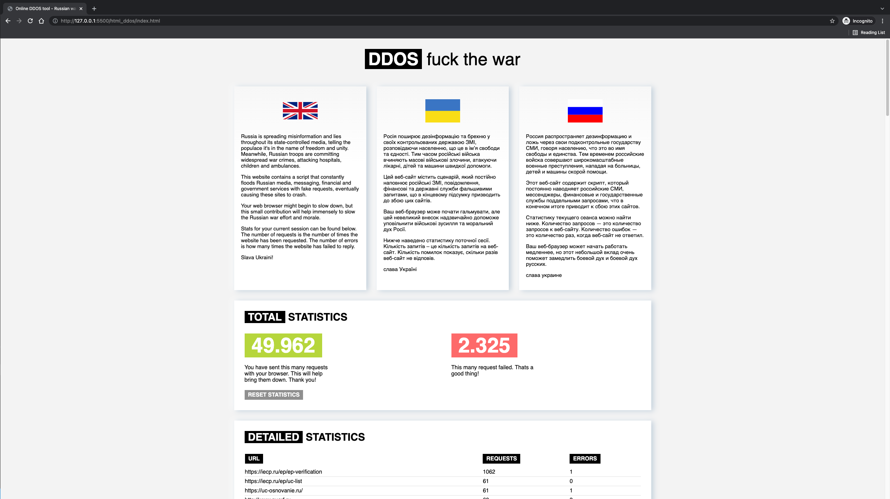

# Instruction

Any `localhost` will do, for example, the [LiveServer](https://marketplace.visualstudio.com/items?itemName=ritwickdey.LiveServer) for [Visual Studio Code (VSCode)](https://code.visualstudio.com) with "Open with Live Server", as on the picture. You can also host this on your website (and shared with others), like https://ddosrussia.netlify.app does.

## Live Server in Visual Studio Code (VSCode) launch

